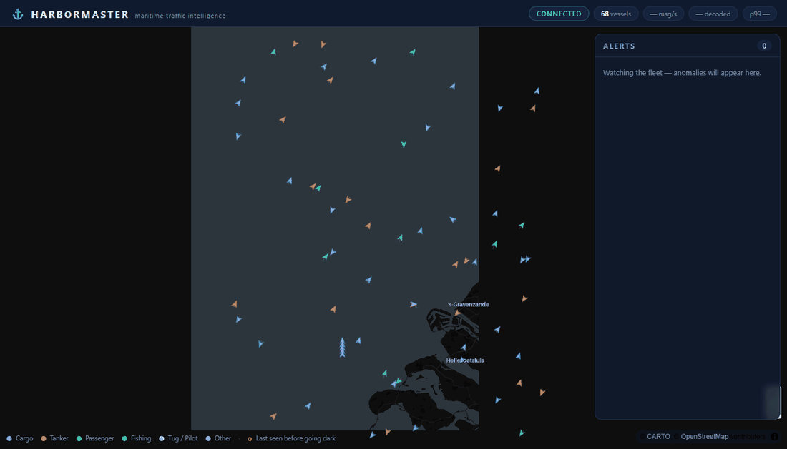
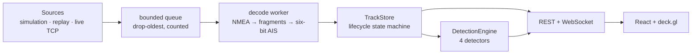

# ⚓ Harbormaster

**Real-time maritime traffic intelligence from raw AIS radio sentences** — live vessel tracking with automatic detection of the evasion patterns used by sanctioned and illegally operating ships.

[](https://github.com/boazhemmo-git/harbormaster/actions/workflows/ci.yml)




Ships that want to hide — sanctions evaders, illegal fishing fleets, smugglers — switch off their AIS transponders ("going dark"), spoof their GNSS positions, or meet mid-sea for ship-to-ship transfers. Harbormaster watches a live AIS feed and surfaces exactly those patterns, in real time, on a dark-mode tactical map.

## What it does

- **Decodes the radio protocol from scratch** — NMEA 0183 sentence validation (checksums, TAG blocks, multi-fragment reassembly) and bit-level ITU-R M.1371 six-bit decoding for message types 1/2/3/5/18/19/24. No AIS library; that's the point ([ADR-0004](docs/adr/0004-from-scratch-ais-decoder.md)).
- **Tracks every vessel through a lifecycle state machine** — `ACQUIRING → ACTIVE → COASTING → LOST`, with bounded fix history and identity merged from Class A voyage data and two-part Class B reports.
- **Detects four anomaly patterns**:
  | Detector | Pattern | Real-world meaning |
  |---|---|---|
  | 🕳️ AIS gap | transmission stops while underway | deliberate transponder shutdown |
  | ⚡ Kinematic | implied speed physically impossible | GNSS/AIS position spoofing |
  | 🔗 Rendezvous | two vessels station-keeping <300 m at sea | ship-to-ship cargo/fuel transfer |
  | 🛑 Loitering | claims "under way", never moves | waiting, drifting, or lying |
- **Streams it live** — REST snapshots plus a WebSocket feed of position deltas, alerts and pipeline stats (msg/s, decode errors, receive→applied p99 latency) into a React + deck.gl map UI.

## Quickstart

```bash
docker compose up --build
# open http://localhost:3000
```

That's it — no API keys, no accounts. The default source is a **deterministic scripted scenario**: ~120 vessels in the North Sea off Rotterdam, encoded into genuine AIVDM sentences (checksums, fragmentation and all) so the entire wire path runs exactly as against a live feed. Four scripted actors fire every detector within the first ten minutes:

| T+ | Event |
|---|---|
| ~3 min | a tanker's position teleports 25 nm — **spoofing alert** |
| ~4 min | two freighters hold station 150 m apart — **rendezvous alert** |
| ~7 min | a tanker that silenced its transponder at 12 kn is declared lost — **dark ship alert** |
| ~10 min | a "fishing" vessel claiming underway hasn't moved — **loitering alert** |

Simulated vessels are prefixed `SIM` — no pretense ([ADR-0002](docs/adr/0002-simulation-first-demo.md)).

### Real data modes

```bash
# Replay the bundled real capture (Norwegian Coastal Administration feed, NLOD license)
HARBORMASTER_SOURCE_MODE=REPLAY docker compose up

# Stream the live open feed
HARBORMASTER_SOURCE_MODE=LIVE_TCP docker compose up
```

### Local development

```bash
cd backend && ./mvnw spring-boot:run     # API on :8080
cd frontend && npm ci && npm run dev     # UI on :5173, proxied to the backend
```

## 🤖 Ask an AI about the traffic (MCP server)

The repo ships an [MCP](https://modelcontextprotocol.io) server so AI agents can interrogate the live picture in natural language — *"which tankers went dark in the last hour?"*, *"any rendezvous alerts near the coast?"*:

```bash
cd mcp-server && ../backend/mvnw -f pom.xml package
```

A `.mcp.json` is included, so opening this repo in **Claude Code** picks the server up automatically (with the backend running). For other MCP clients:

```json
{ "command": "java", "args": ["-jar", "mcp-server/target/harbormaster-mcp.jar"] }
```

Five tools: `get_fleet_overview`, `find_dark_ships`, `list_alerts`, `find_vessels`, `get_vessel`. In keeping with the house style, the stdio JSON-RPC transport is implemented from the MCP specification — no SDK, Jackson as the only dependency, tested at the raw-protocol level ([ADR-0005](docs/adr/0005-hand-rolled-mcp-server.md)). It consumes the same public REST API as the browser UI: an adapter, not a backdoor.

## Architecture



Single-writer core on a virtual thread, sealed message hierarchy so the routing switch is compile-time exhaustive, detectors as contained strategies, backpressure that drops *oldest* and counts what it dropped. The full walkthrough is in [docs/architecture.md](docs/architecture.md); the trade-offs each have an ADR ([why no Kafka](docs/adr/0001-in-process-pipeline-no-kafka.md), [why no database](docs/adr/0003-bounded-in-memory-state.md)).

## Testing

```bash
cd backend && ./mvnw verify
```

Decoder correctness is anchored three independent ways:

1. **Published golden vectors** from the AIVDM/AIVDO protocol documentation.
2. **Round-trips against an independently written bit-packer** — write-path vs read-path, so a symmetric offset error can't cancel itself out.
3. **A real recorded capture decoded end-to-end**, asserting every position lands inside the source network's true geographic footprint (mainland Norway through Svalbard). A sign flip scatters ships across the globe and fails loudly.

Detector suites cover the true-positive scenario *and* the boring explanations that must stay silent: moored vessels falling quiet, fast ferries being fast, tugs coming alongside, anchored ships sitting still.

## Honest limits

This is a demonstration system and says so: shore-station coverage gaps are indistinguishable from deliberate shutdown at this fidelity (real systems fuse coverage maps and satellite AIS), state is bounded in-memory by design, and the behavioral rules are kinematic heuristics, not learned models. Alerts are evidence to investigate, not verdicts.

## Data & attribution

- Bundled capture and default live feed: [Norwegian Coastal Administration](https://www.kystverket.no/) open AIS, [NLOD license](https://data.norge.no/nlod/en/2.0).
- Basemap: [CARTO](https://carto.com/attributions) dark matter style, © [OpenStreetMap](https://www.openstreetmap.org/copyright) contributors.

## License

[MIT](LICENSE) — © 2026 Boaz Hemmo
