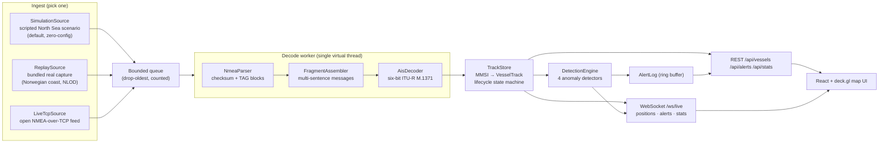

# Architecture

Harbormaster is a single-writer, event-driven pipeline: raw NMEA lines enter
on one side, a live tactical picture and anomaly alerts exit on the other.

## Design language

- **Sealed message hierarchy** (`AisMessage`) — the pipeline's routing switch
  is exhaustive at compile time; adding message type support is a checklist
  the compiler enforces.
- **Single-writer core** — one virtual-thread decode worker owns all mutation
  of the track store, making the assembler lock-free and the store's
  concurrency model trivial to reason about (ADR-0001).
- **Detectors as strategies** — each anomaly rule implements
  `AnomalyDetector` and reacts to three pipeline events (`onFix`,
  `onStateChange`, `onSweep`). A failing detector is contained and logged;
  it can never stall ingest.
- **Lifecycle as data** — `ACQUIRING → ACTIVE → COASTING → LOST` transitions
  are produced by the sweep and consumed by detectors (dark-ship keys off
  `→ LOST`), so "a vessel disappeared" is an event, not a query.

## Package map (backend)

| Package | Responsibility |
|---|---|
| `ingest` | Sources producing raw NMEA lines on their own virtual threads |
| `nmea` | Sentence validation, checksum, TAG blocks, fragment reassembly |
| `ais` | Six-bit bit-level decode/encode, typed message records |
| `tracking` | Vessel state, fix history, lifecycle sweep |
| `detection` | Anomaly detectors, alert log, fan-out engine |
| `pipeline` | Queue, worker, wiring, counters/latency stats |
| `api` | REST controllers, WebSocket broadcaster, DTOs |
| `config` | Typed `@ConfigurationProperties` records |

## Data flow guarantees

- **Backpressure**: the ingest queue is bounded (10k lines). Overflow drops
  the *oldest* line and increments a visible counter — under a burst the
  freshest picture wins and the loss is measurable, never silent.
- **Latency**: each line carries its arrival timestamp; the decode worker
  records receive→applied latency into a sliding window. p50/p99 are exposed
  on `/api/stats` and in the UI header.
- **Alert hygiene**: per-vessel, per-detector cooldowns plus pair cooldowns
  in the rendezvous detector keep one misbehaving transponder from flooding
  the feed.

## Honest limits

This is a demonstration system, deliberately scoped:

- Shore-station coverage gaps are indistinguishable from deliberate
  transponder shutdown at this fidelity — a real system fuses coverage maps
  and satellite AIS before calling something "dark". Alerts are evidence to
  investigate, not verdicts.
- Track history lives in bounded memory (ADR-0003); restarts start clean.
- Loitering/rendezvous use simple kinematic rules, not learned behavior
  models, and exclude port-service vessel types rather than modeling ports.
